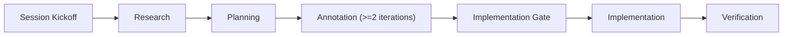

# Coding Agent Sidekick

<p align="center">
  
</p>

[](#workflow-standard)
[](#project-modes)
[](#governance-defaults)
[](#governance-defaults)

An operational, agent-first template to ship software with discipline from day 0.

If you want a repository that scales with coding agents without losing quality, this is built for you.

## One-Command Start
Start a new session by typing only:
- `Iniziamo`
- `Let's start`
- or the same intent in your language

The agent should:
1. keep your language,
2. ask the right kickoff questions,
3. set up your first activity through the standard workflow.

## Why This Template Is Different
- Strict stage gates: no implementation without approved planning artifacts.
- Multi-agent ready: implementation and validation roles are explicitly separated.
- Existing-codebase support: baseline + context-pack model to avoid full-repo token waste.
- GitHub-ready policies: PR template, issue templates, commit checks, docs/security workflows.

## Table of Contents
- [What You Get](#what-you-get)
- [One-Command Start](#one-command-start)
- [Project Modes](#project-modes)
- [Quick Start](#quick-start)
- [Workflow Standard](#workflow-standard)
- [Command Cheatsheet](#command-cheatsheet)
- [Repository Map](#repository-map)
- [Governance Defaults](#governance-defaults)
- [GitHub Setup](#github-setup)
- [Beginner Path](#beginner-path)
- [License](#license)

## What You Get
- Process documentation in English (`docs/process/`).
- Templates for research, planning, and ADRs (`docs/templates/`).
- Automation scripts for kickoff, plan gates, and baseline maintenance (`scripts/`).
- Existing-codebase baseline artifacts (`docs/baseline/`).
- PR and issue policy templates plus CI checks (`.github/`).
- Local commit-message hook support (`.githooks/`).

## Project Modes

| Mode | Use When | Mandatory Extras |
|---|---|---|
| `greenfield` | New app or isolated subsystem | Standard workflow artifacts only |
| `existing` | Changes in a legacy/active codebase | Baseline bootstrap, context pack, compatibility/rollback/regression controls |

## Quick Start

### 0) Session kickoff (recommended)
Type:
```text
Iniziamo
```
or:
```text
Let's start
```
or equivalent intent in your language.

The kickoff protocol is defined in `docs/process/session-start.md`.

### 1) Manual commands (before GitHub repository creation)
```bash
make help
make kickoff FEATURE="oauth-login" MODULE="auth" MODE="greenfield"
make kickoff FEATURE="oauth-login" MODULE="auth" MODE="existing"
make bootstrap-existing-baseline SOURCE_PATH="."
make new-context-pack FEATURE="oauth-login" TARGET_PATHS="src/auth,src/api"
make coach FEATURE="oauth-login"
make new-research MODULE="auth" MODE="greenfield"
make new-plan FEATURE="oauth-login" MODE="greenfield"
make update-baseline FEATURE="oauth-login" SUMMARY="updated auth flow" SOURCE_PATH="." TARGET_PATHS="src/auth,src/api"
make new-adr TITLE="Auth provider choice"
```

### 2) When you create the GitHub repository
```bash
scripts/init-repo.sh
scripts/install-hooks.sh
```

Then configure branch protection with `docs/runbooks/github-setup.md`.

## Workflow Standard



For `existing` mode, prepend baseline/context-pack setup and append baseline refresh:

`Session Kickoff -> Baseline Bootstrap -> Context Pack -> Research -> Planning -> Annotation -> Implementation Gate -> Implementation -> Baseline Refresh -> Verification`

## Command Cheatsheet

| Command | Purpose |
|---|---|
| `Iniziamo` / `Let's start` / equivalent intent in your language | Starts guided intake and first-task setup |
| `make kickoff FEATURE="<feature>" MODULE="<module>" MODE="<mode>"` | Create research + plan scaffolding (`<mode>` is `greenfield` or `existing`) |
| `make coach FEATURE="<feature>"` | Show next step from current artifact state |
| `make validate-plan FILE="docs/plans/<feature>-plan.md"` | Validate plan structure and required fields |
| `make implementation-gate FEATURE="<feature>"` | Enforce approval + annotation completion before coding |
| `make bootstrap-existing-baseline SOURCE_PATH="."` | One-time baseline for existing repositories |
| `make new-context-pack FEATURE="<feature>" TARGET_PATHS="path/a,path/b"` | Create selective context for a feature |
| `make update-baseline FEATURE="<feature>" SUMMARY="<summary>" SOURCE_PATH="." TARGET_PATHS="path/a,path/b"` | Refresh baseline after coding-agent changes |
| `make validate-pr` | Validate PR body format and policy fields |
| `PR_BODY_FILE="docs/pr-body.md" make validate-pr` | Validate PR body locally with an explicit file |
| `make check-commits RANGE="HEAD~10..HEAD"` | Conventional Commit enforcement over a range |

Local note: `make validate-pr` without `PR_BODY_FILE` intentionally skips local validation.

## Repository Map

```text
.claude/           Agent context and prompt templates
docs/              Process, templates, checklists, decisions, baseline
scripts/           Automation and validation scripts
.github/           Issue/PR templates and CI workflows
.githooks/         Optional local commit-msg hook
```

## Governance Defaults
- Documentation language: English.
- License: Proprietary (All rights reserved).
- Commit convention: Conventional Commits.
- Initial enforcement: Medium (blocking CI checks on PR, local hooks optional).
- Agent model: vendor-agnostic.
- Project modes: `greenfield` and `existing`.

## GitHub Setup
1. Run `scripts/init-repo.sh`.
2. Run `scripts/install-hooks.sh`.
3. Push repository and set branch protection on `main`.
4. Require checks from `docs/runbooks/github-setup.md`:
   - `docs-and-style`
   - `policy-check`
   - `security-scan`

## Beginner Path
1. Start the session with `Iniziamo` (or equivalent intent in your language).
2. Read `ONBOARDING.md`.
3. Read `docs/process/start-here.md`.
4. Start with `make kickoff FEATURE="<feature>" MODULE="<module>" MODE="<greenfield|existing>"` when the agent reaches artifact setup.
5. Run `make coach FEATURE="<feature>"` after every update.
6. Validate before implementation:
   - `make validate-plan FILE="docs/plans/<feature>-plan.md"`
   - `make implementation-gate FEATURE="<feature>"`
   - `PR_BODY_FILE="docs/pr-body.md" make validate-pr`
7. For `existing` mode, always refresh baseline after coding-agent changes.

If this template helped you ship faster with better quality, consider leaving a star.

## License
Proprietary. See `LICENSE`.
